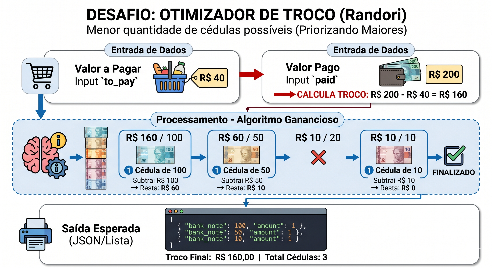

# 🎯 Desafio: Otimizador de Troco

O objetivo é desenvolver um algoritmo que calcule a **menor quantidade possível de cédulas** para compor o troco de uma transação. O sistema deve priorizar sempre as notas de maior valor para minimizar o volume de papel moeda entregue ao cliente.



---

### 💵 Cédulas Disponíveis

Considere que o caixa possui notas de:

* R$ 100,00
* R$ 50,00
* R$ 20,00
* R$ 10,00
* R$ 5,00
* R$ 2,00

---

### 📥 Entrada (Input)

O sistema receberá um objeto JSON com o valor total da compra (`to_pay`) e o valor entregue pelo cliente (`paid`).

```json
{
  "to_pay": 40,
  "paid": 200
}
```

---

### 📤 Saída (Output)

A resposta deve ser uma lista de objetos detalhando a nota (`bank_note`) e a quantidade (`amount`), ordenada da **maior nota para a menor**.

```json
[
  {
    "bank_note": 100,
    "amount": 1
  },
  {
    "bank_note": 50,
    "amount": 1
  },
  {
    "bank_note": 10,
    "amount": 1
  }
]
```

---

### 📝 Regras de Negócio

1.  **Cálculo do Troco:** O valor total do troco é $paid - to\_pay$. No exemplo acima, o troco é **R$ 160,00**.
2.  **Algoritmo Guloso (Greedy Algorithm):** O algoritmo deve subtrair o máximo possível da maior nota antes de passar para a próxima (ex: para R$ 150, prefira 1x100 e 1x50 em vez de 3x50).
3.  **Validação:** Caso o valor pago seja menor que o valor a pagar, o sistema deve retornar um erro amigável ou uma lista vazia, dependendo da sua implementação.
4.  **Moedas:** Para este desafio, ignore moedas. Considere apenas valores inteiros que possam ser supridos pelas cédulas acima.
