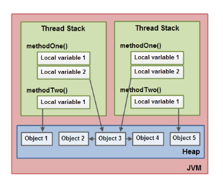

If two threads were executing the run() method then the diagram shown earlier would be the outcome. The run() method calls methodOne() and methodOne() calls methodTwo().

methodOne() declares a primitive local variable (localVariable1 of type int) and an local variable which is an object reference (localVariable2).

Each thread executing methodOne() will create its own copy of localVariable1 and localVariable2 on their respective thread stacks. The localVariable1 variables will be completely separated from each other, only living on each thread's thread stack. One thread cannot see what changes another thread makes to its copy of localVariable1.

Each thread executing methodOne() will also create their own copy of localVariable2. However, the two different copies of localVariable2 both end up pointing to the same object on the heap. The code sets localVariable2 to point to an object referenced by a static variable. There is only one copy of a static variable and this copy is stored on the heap. Thus, both of the two copies of localVariable2 end up pointing to the same instance of MySharedObject which the static variable points to. The MySharedObject instance is also stored on the heap. It corresponds to Object 3 in the diagram above.

Notice how the MySharedObject class contains two member variables too. The member variables themselves are stored on the heap along with the object. The two member variables point to two other Integer objects. These Integer objects correspond to Object 2 and Object 4 in the diagram above.

Notice also how methodTwo() creates a local variable named localVariable1. This local variable is an object reference to an Integer object. The method sets the localVariable1 reference to point to a new Integer instance. The localVariable1 reference will be stored in one copy per thread executing methodTwo(). The two Integer objects instantiated will be stored on the heap, but since the method creates a new Integer object every time the method is executed, two threads executing this method will create separate Integer instances. The Integer objects created inside methodTwo() correspond to Object 1 and Object 5 in the diagram above.

Notice also the two member variables in the class MySharedObject of type long which is a primitive type. Since these variables are member variables, they are still stored on the heap along with the object. Only local variables are stored on the thread stack.